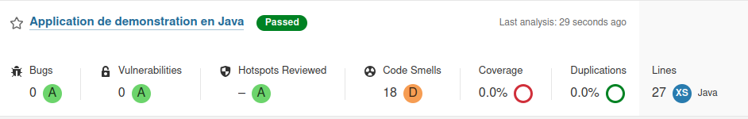
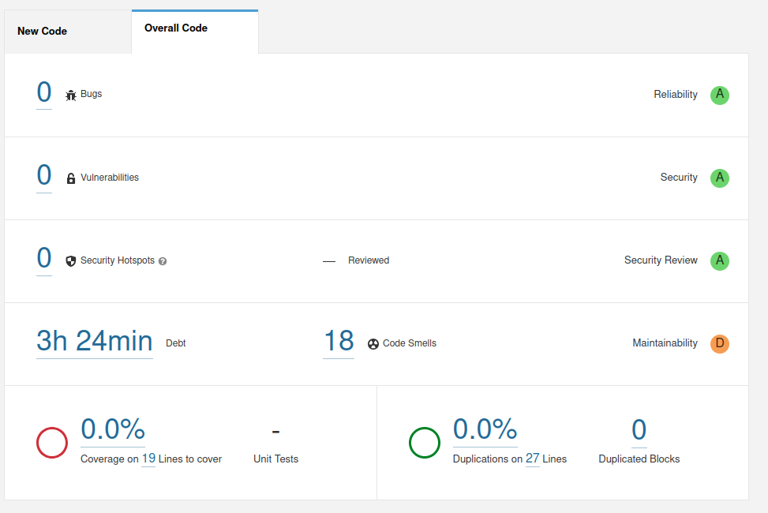
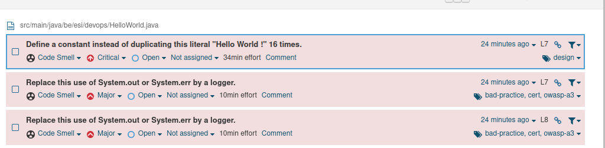
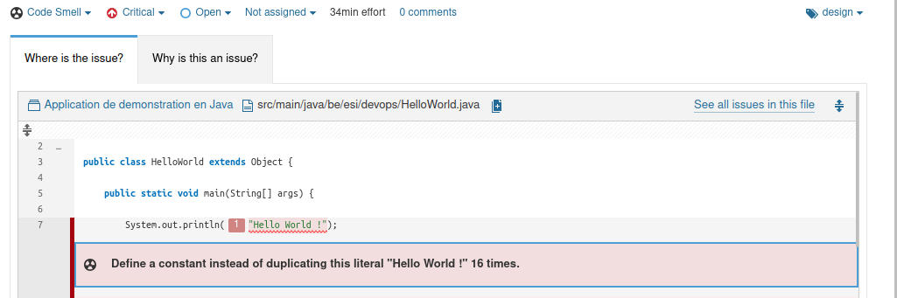
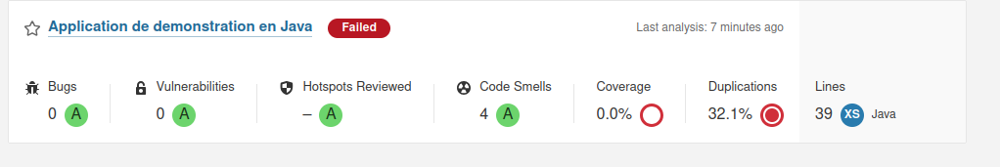

import Tabs from '@theme/Tabs';
import TabItem from '@theme/TabItem';

# TD 06 - Vérifier avec Sonarqube

SonarQube est une plateforme d’analyse de la qualité du code qui permet 
d’évaluer, surveiller et améliorer la qualité du code source d’un 
projet. Il prend en charge plusieurs langages de programmation dont Java
et Python. 
Ce TD vous apprendra à utiliser les rapports générés par 
SonarQube pour détecter et corriger les bugs, vulnérabilités et 
mauvaises pratiques.

### Objectifs 

À l’issue de ce TD, vous serez capable d' :

- Installer et configurer SonarQube via Docker pour analyser des projets 
dans différents langages.
- Analyser un projet Java avec SonarQube pour identifier des erreurs, une complexité excessive, des vulnérabilités et une couverture de tests insuffisante.
- Analyser un projet Python avec SonarQube et interpréter les résultats d'analyse similaires à ceux du projet Java.

:::warning Pré-requis

1. Connaissance de base en Java, Python, Docker et des commandes shell.
1. Un environnement de travail prêt avec Java (JDK 17 minimum), Python 3.8+ et un IDE.

:::

## Installation de SonarQube avec Docker

### Création d'un réseau Docker

SonarQube se compose de deux conteneurs distincts :

- Le serveur SonarQube
- Le scanner SonarQube

Pour permettre leur communication, il est nécessaire de créer un réseau Docker dédié. Exécutez la commande suivante pour créer ce réseau : 

```sh
docker network create sonar-network
```

### Installation et démarrage du serveur SonarQube

Le serveur SonarQube est le cœur du système. Il est responsable du stockage, de l'analyse et de l'affichage des résultats des analyses de code. Il comprend plusieurs composants :

- Base de données : Stocke les résultats des analyses, les configurations des projets et les paramètres de qualité.
- Moteur d'analyse : Traite les rapports envoyés par les scanners et applique les règles de qualité du code.
- Interface web : Permet aux développeurs et aux équipes de visualiser les rapports, d'explorer les problèmes détectés et de suivre la qualité du code.

Exécutez la commande suivante pour lancer un conteneur SonarQube sur le réseau Docker créé précédemment :

```sh
docker run -d --name sonarqube --network sonar-network -p 9000:9000 sonarqube:lts-community
```

Cette commande démarre SonarQube en mode détaché (`-d`), le connecte au réseau `sonar-network` et l'expose sur le port `9000`.

Les informations sur cette image sont disponibles sur [Docker Hub](https://hub.docker.com/_/sonarqube).

:::warning 

Consultez les logs du conteneur SonarQube pour savoir si il a démarré avec succès.

:::

### Connexion à l'interface SonarQube

**Une fois SonarQube démarré**, ouvrez un navigateur et accédez à l'URL 
[http://localhost:9000](http://localhost:9000).

Utilisez les identifiants par défaut pour vous connecter :

- *Nom d'utilisateur* : admin
- *Mot de passe* : admin

### Création d'un token d'authentification

Un token d’authentification est nécessaire pour permettre au scanner SonarQube d’envoyer les résultats d’analyse au serveur SonarQube, sans avoir à saisir manuellement des identifiants.

Une fois connecté au serveur SonarQube :

- Allez dans *Mon compte* (en haut à droite).
- Sélectionnez l'onglet *Tokens*.
- Remplissez le formulaire de génération d'un token  :
   - *Name* : premier-token
   - *Type* : Global Analysis Token
   - *Expires in* : 30 jours
- Cliquez sur *Generate*.
- Copiez le token généré, car il ne sera plus affiché.

### Installation de Sonar Scanner CLI

Le scanner SonarQube est l'outil qui analyse le code source avant d'envoyer les résultats au serveur. Il fonctionne de la manière suivante :

- Il analyse le code source selon un ensemble de règles prédéfinies.
- Il génère un rapport contenant les erreurs, les vulnérabilités, la complexité du code, la dette technique,...
- Il envoie ce rapport au serveur SonarQube pour traitement et affichage dans l'interface web.

Téléchargez et installez l'outil Sonar Scanner CLI pour analyser votre code via l'image dédiée :

```sh
docker pull sonarsource/sonar-scanner-cli
```

## Analyse d'un projet java

Dans cet exercice, vous allez découvrir comment analyser la qualité du code d’un projet Java en utilisant SonarQube. L'objectif est de configurer un projet, d'exécuter une analyse avec Sonar Scanner et de consulter les résultats sur le serveur SonarQube.
Ce premier exemple est repris du [dépôt sonar-training-exemples](https://github.com/SonarSource/sonar-training-examples).

Commencez par créer le projet java `quality-demo` et ajoutez-y la classe `HelloWorld`.

```java title="HelloWorld.java" showLineNumbers
public class HelloWorld {

    public static void main(String[] args) {

      System.out.println("Hello World !");
      System.out.println("Hello World !");
      System.out.println("Hello World !");
      System.out.println("Hello World !");
      System.out.println("Hello World !");
      System.out.println("Hello World !");
      System.out.println("Hello World !");
      System.out.println("Hello World !");
      System.out.println("Hello World !");
      System.out.println("Hello World !");
      System.out.println("Hello World !");
      System.out.println("Hello World !");
      System.out.println("Hello World !");
      System.out.println("Hello World !");
      System.out.println("Hello World !");
      System.out.println("Hello World !");
    }

}
```

### Première analyse : un succès

Créez à la racine du projet le fichier `sonar-project.properties` ci-dessous. Ce fichier de configuration est utilisé par Sonar Scanner
pour définir les paramètres d’analyse d’un projet. 
Il spécifie des informations essentielles telles que le nom du projet, 
la version, les chemins des fichiers source et des tests.

```yaml
# Identifiant du projet.
# Doit être unique dans l’instance SonarQube.
# Obligatoire
sonar.projectKey=quality-demo-java

# Nom du projet tel qu’il apparaîtra dans l’interface web.
# Obligatoire
sonar.projectName=Application de demonstration en Java

# Permet de suivre l'évolution de la qualité entre différentes versions
# Facultatif
sonar.projectVersion=1.0

# Répertoire de base du projet
# Par défaut SonarScanner utilise le dossier où il est exécuté.
# Facultatif
sonar.projectBaseDir=.

# Spécifie où se trouvent les fichiers source à analyser.
# Obligatoire
sonar.sources=src/main/java

# Répertoire contenant les fichiers de bytecode compilés (.class)
# Obligatoire pour Java. SonarQube a besoin des fichiers 
# compilés pour effectuer certaines analyses (comme la détection 
# des problèmes de type ou de complexité cyclomatique).
sonar.java.binaries=target/classes
```

:::tip Propriété spécifique à un language

Il est important de noter que la propriété *sonar.java.binaries* est 
spécifiquement dédiée à la configuration des fichiers binaires **Java** 
(comme les fichiers .class), tandis que *sonar.sources* s'applique à tous les langages du projet, permettant de spécifier les répertoires 
contenant le code source de l'ensemble du projet, 
**quel que soit le langage** utilisé.

:::

Dans le dossier racine de votre projet, exécutez la commande suivante,
en y ajoutant votre token, pour démarrer l'analyse : 

```sh
docker run --rm --network sonar-network -v "$(pwd):/usr/src" -e SONAR_HOST_URL="http://sonarqube:9000" -e SONAR_TOKEN="VOTRE_TOKEN_ICI" sonarsource/sonar-scanner-cli
```

:::tip Docker run

Testez votre mémorisation des paramètres des commandes Docker
en essayant d'expliquer les paramètres : 

- `--rm`
- `-v "$(pwd):/usr/src"`
- `-e SONAR_HOST_URL="http://sonarqube:9000"`

N'hésitez pas à [consulter la documentation](https://docs.docker.com/reference/cli/docker/container/run/) 
en cas de doute
et à en discuter avec votre enseignant·e.

:::

Une fois l'analyse terminée, consultez le résultat sur le serveur [http://localhost:9000/projects](http://localhost:9000/projects).
Vous devriez obtenir un résultat similaire à celui présenté ci-dessous.



:::info Catégories d'analyse

Lorsqu’un projet est analysé dans SonarQube, plusieurs catégories permettent d’évaluer la qualité du code, la sécurité, et la maintenabilité. Voici un aperçu détaillé de ces catégories :
 - **Bugs** : Ce sont des erreurs dans le code qui peuvent provoquer des comportements inattendus, des plantages ou des résultats incorrects. Par exemple : 
    - Accès à une variable null pouvant entraîner une NullPointerException.
    - Boucle infinie causant un blocage du programme.
    - Erreur de logique (exemple : une condition if toujours fausse).
- **Vulnerabilities** : Cette catégorie regroupe les failles de sécurité pouvant être exploitées par un attaquant. Par exemple : 
    - Injection SQL (SQL Injection).
    - Faille XSS (Cross-Site Scripting).
    - Stockage de mots de passe en clair dans le code.
- **Hotspots Reviewed** : Ce sont des zones du code sensibles sur le plan de la sécurité, mais qui ne sont pas nécessairement des vulnérabilités. Elles nécessitent une revue manuelle pour évaluer si un risque existe.
- **Code Smells** : Indique les problèmes de maintenabilité qui rendent le code plus difficile à comprendre ou à modifier. Par exemple : 
    - Fonctions trop longues ou trop complexes.
    - Duplication excessive de code.
    - Mauvaise utilisation des conventions de codage.
- **Coverage** : Mesure le pourcentage de code couvert par des tests unitaires. Une faible couverture indique que certaines parties du code ne sont pas testées. 
    - Une couverture de 80% signifie que 20% du code n’a pas été testé.
- **Duplications** : Analyse la répétition excessive de blocs de code dans le projet. 
    - Copier/coller d’un même bloc de logique dans plusieurs fichiers.
    - Redondance de méthodes avec des fonctionnalités identiques.
- **Lines** : Indique le nombre total de lignes de code dans le projet. Cette métrique permet d’avoir une idée de la taille et de la complexité du projet.
    - Un projet avec 50 000 lignes de code est généralement plus difficile à maintenir qu’un projet de 5 000 lignes.

:::

Dans SonarQube, chaque catégorie est accompagnée d'une note de gravité représentée par des lettres (A, B, C, D, E) pour indiquer l'importance des problèmes détectés dans le code. Ces lettres permettent de prioriser les actions à prendre pour corriger les problèmes.

- **A** : Problème critique, nécessite une attention immédiate et doit être corrigé en priorité.
- **B** : Problème majeur, important mais non bloquant, à résoudre dès que possible.
- **C** : Problème mineur, moins critique, à corriger mais pas urgent.
- **D** : Problème faible, a peu d'impact, à résoudre à moyen terme.
- **E** : Problème très faible ou informatif, sans impact notable, peut être ignoré ou corrigé plus tard.

Cliquez sur le nom du projet et accédez au tableau de bord du projet.
Vous devriez obtenir un résultat similaire à celui présenté ci-dessous.



:::tip dette technique

La dette technique fait référence au compromis entre la rapidité de 
développement à court terme et la qualité du code à long terme. 
Elle se produit lorsqu'un développeur choisit une solution plus rapide 
mais moins idéale ou propre, dans le but de gagner du temps. 
À mesure que cette dette s'accumule, le code devient de plus en plus
difficile à maintenir, à tester et à modifier, nécessitant un 
investissement supplémentaire pour "rembourser" la dette en réécrivant
ou en améliorant le code.

Le nombre d'heures affiché est une estimation qui donne aux développeurs 
une idée de l'ampleur du travail nécessaire pour améliorer la qualité du
code, réduire la dette technique et ainsi améliorer la maintenabilité du 
projet.

:::

L'analyse du projet est divisée en deux onglets :

- **New Code** met l'accent sur la qualité du code récemment ajouté.
- **Overall Code** offre une vue d’ensemble, incluant à la fois l’ancien et le nouveau code.

Grâce à ces onglets, l’équipe de développement peut suivre la qualité du code en cours tout en gérant progressivement la dette technique.

Consultez la liste des problèmes détectés en cliquant sur le bouton **Code Smells**. Vous devriez obtenir un résultat similaire à celui présenté ci-dessous.



SonarQube détecte clairement un problème de répétition de code, indiquant qu’il est préférable de définir une constante plutôt que de dupliquer 16 fois la chaîne de caractères "Hello World !".

De plus, chaque utilisation de `System.out.println()` est signalée comme un souci. SonarQube recommande d’utiliser un logger à la place, afin d'améliorer la gestion des messages et d'offrir un meilleur contrôle sur les logs de l’application.

En cliquant sur un des problèmes détectés, l'onglet "Why is this an issue ?" fournit une explication détaillée sur la raison de cette recommandation.



Modifiez la classe `HelloWorld` pour corriger la duplication signalée

```java title="HelloWorld.java" showLineNumbers
public class HelloWorld {

    public static void main(String[] args) {
        System.out.println("Hello World !");
    }

}
```

Lancez une nouvelle analyse via la commande : 

```sh
docker run --rm --network sonar-network -v "$(pwd):/usr/src" -e SONAR_HOST_URL="http://sonarqube:9000" -e SONAR_TOKEN="VOTRE_TOKEN_ICI" sonarsource/sonar-scanner-cli
```

En consultant le rapport sur le serveur, vous constaterez que le nouveau code ne présente plus aucune erreur. Toutefois, l’onglet **Overall Code** signale toujours l’utilisation de l’instruction `System.out`.

### Seconde analyse : un échec

Ajoutez la classe `ComplexMethod` au projet `quality-demo` afin 
d’explorer un nouveau type d’erreur. La méthode `intToEnglishValue`
retourne le anglais correspondant au chiffre donné en paramètre.

```java title="ComplexMethod.java" showLineNumbers
public class ComplexMethod {

    public String intToEnglishValue(int i) {
/*        if (i == 0) {
            int k = 10 / i;
        }
*/
        if (i == 1) {
            return "One";
        }
        if (i == 2) {
            return "Two";
        }
        if (i == 3) {
            return "Three";
        }
        if (i == 4) {
            return "Four";
        }
        if (i == 5) {
            return "Five";
        }
        if (i == 6) {
            return "Six";
        }
        if (i > 6) {
            throw new RuntimeException();
        }
        return null;
    }

}
```

Relancez une analyse et consultez le rapport.



Votre projet ne respecte pas les critères de qualité attendus, entraînant l’échec de l’analyse. Corrigez les problèmes détectés, puis effectuez une nouvelle analyse. Par exemple la méthode peut retourner
la valeur de la case `i` du tableau `String[] values = {"", "One", "Two", "Three", "Four", "Five", "Six"};`.

:::info Quality gate

La Quality Gate dans SonarQube est un ensemble de critères de qualité définis pour déterminer si un projet respecte les standards exigés avant d’être validé.

Exemple d’un Quality Gate par défaut :

- Aucun bug ou vulnérabilité critique
- Couverture des tests ≥ 80%
- Duplication du code ≤ 3%

Les Quality Gates peuvent être personnalisés pour s’adapter aux exigences spécifiques d’un projet via le menu [http://localhost:9000/quality_gates](http://localhost:9000/quality_gates).

:::

### Complexité cognitive

:::info

La complexité cognitive dans SonarQube évalue la difficulté de compréhension et de maintenance du code, en tenant compte des boucles imbriquées, conditions et interactions entre les éléments. Lorsqu’une méthode dépasse le seuil fixé, elle devient difficile à lire et à maintenir.

Cette notion est inspirée de la [complexité cyclomatique](https://en.wikipedia.org/wiki/Cyclomatic_complexity) mesurant le nombre de chemins d’exécution possibles dans le code. Une forte complexité cognitive résulte souvent d’une complexité cyclomatique élevée, due à trop de branches, d’imbrications ou de logique complexe.

:::

Ajoutez la classe `Complexity` au projet `quality-demo` pour illustrer 
la notion de complexité cognitive. La méthode publique de cette classe 
permet de compter le nombre de voyelles dans un mot donné en paramètre.

```java title="Complexity.java" showLineNumbers
public class Complexity {

   public String countVowels(String word) {
      int count = 0;
      String[] vowels = {"a", "e", "i", "o", "u"};

      for (String c : word.split("")) {
         for (String v : vowels) {
            if (c.equalsIgnoreCase(v)) {
               count++;
            }
         }
      }

      if (count == 0) {
         if (word.isEmpty()) {
            return "empty string does not contain vowels";
         } else if (word.length() < 5) {
            return "word with less than 5 characters does not contain vowels";
         } else {
            return "word does not contain vowels";
         }
      } else {
         if (count == 1) {
            return "contains one vowel";
         } else if (count < 5) {
            return "contains few vowels";
         } else {
            return "contains many vowels";
         }
      }
   }

}
```

Vérifiez qu'en lançant une analyse, une nouvelle issue liée à la complexité du projet sera détectée.

Ensuite simplifiez cette complexité en corrigeant la classe, par exemple
en décomposant la méthode publique :

```java title="Complexity.java" showLineNumbers
public String countVowels(String word) {
    int count = countVowelOccurrences(word);
    
    if (count == 0) {
        return getNoVowelMessage(word);
    } else {
        return getVowelCountMessage(count);
    }
}

private int countVowelOccurrences(String word) {
    int count = 0;
    String[] vowels = {"a", "e", "i", "o", "u"};

    for (String c : word.split("")) {
        for (String v : vowels) {
            if (c.equalsIgnoreCase(v)) {
                count++;
            }
        }
    }
    return count;
}

private String getNoVowelMessage(String word) {
    if (word.isEmpty()) {
        return "empty string does not contain vowels";
    } else if (word.length() < 5) {
        return "word with less than 5 characters does not contain vowels";
    } else {
        return "word does not contain vowels";
    }
}

private String getVowelCountMessage(int count) {
    if (count == 1) {
        return "contains one vowel";
    } else if (count < 5) {
        return "contains few vowels";
    } else {
        return "contains many vowels";
    }
}
```

Relancez une analyse et vérifiez que l'issue concernant 
la complexité a disparu. Les issues bloquantes liées
à la couverture de test sont traitées dans la prochaine section.

### Couverture de test

L'analyse de votre projet échoue toujours car la Quality Gate requiert 
une couverture de test d'au moins 80%. 
Pour répondre à cette exigence, ajoutez des tests unitaires en 
commençant par mettre à jour les dépendances Maven dans le fichier 
`pom.xml`.


```xml title="pom.xml" showLineNumbers
<dependencies>
    <dependency>
        <groupId>org.junit.jupiter</groupId>
        <artifactId>junit-jupiter</artifactId>
        <version>5.12.0</version>
        <scope>test</scope>
    </dependency>
</dependencies>
```

Ensuite créez la classe de test `ComplexityTest.java`.

```java title="ComplexityTest.java" showLineNumbers
import org.junit.jupiter.api.Test;

import static org.junit.jupiter.api.Assertions.*;

class ComplexityTest {
    @Test
    public void testEmptyString() {
        Complexity vowelCounter = new Complexity();
        String result = vowelCounter.countVowels("");
        assertEquals("empty string does not contain vowels", result);
    }

    @Test
    public void testStringWithoutVowels() {
        Complexity vowelCounter = new Complexity();
        String result = vowelCounter.countVowels("bcdfg");
        assertEquals("word does not contain vowels", result);
    }

    @Test
    public void testStringWithOneVowel() {
        Complexity vowelCounter = new Complexity();
        String result = vowelCounter.countVowels("cat");
        assertEquals("contains one vowel", result);
    }

    @Test
    public void testStringWithFewVowels() {
        Complexity vowelCounter = new Complexity();
        String result = vowelCounter.countVowels("audio");
        assertEquals("contains few vowels", result);
    }

    @Test
    public void testStringWithManyVowels() {
        Complexity vowelCounter = new Complexity();
        String result = vowelCounter.countVowels("beautiful");
        assertEquals("contains many vowels", result);
    }

    @Test
    public void testStringWithVowelsIncludingUppercase() {
        Complexity vowelCounter = new Complexity();
        String result = vowelCounter.countVowels("Abcdef");
        assertEquals("contains few vowels", result);
    }

    @Test
    public void testStringWithVowelsAndDifferentLength() {
        Complexity vowelCounter = new Complexity();
        String result = vowelCounter.countVowels("aeiou");
        assertEquals("contains many vowels", result);
    }
}
```

Créez également une classe de test pour la classe `ComplexMethod`.


```java title="ComplexMethodTest.java" showLineNumbers
import org.junit.jupiter.api.Test;

import static org.junit.jupiter.api.Assertions.*;

class ComplexMethodTest {
    @Test
    public void testIntToEnglishValue_One() {
        ComplexMethod complexMethod = new ComplexMethod();
        String result = complexMethod.intToEnglishValue(1);
        assertEquals("One", result);
    }

    @Test
    public void testIntToEnglishValue_Two() {
        ComplexMethod complexMethod = new ComplexMethod();
        String result = complexMethod.intToEnglishValue(2);
        assertEquals("Two", result);
    }

    @Test
    public void testIntToEnglishValue_Three() {
        ComplexMethod complexMethod = new ComplexMethod();
        String result = complexMethod.intToEnglishValue(3);
        assertEquals("Three", result);
    }

    @Test
    public void testIntToEnglishValue_Four() {
        ComplexMethod complexMethod = new ComplexMethod();
        String result = complexMethod.intToEnglishValue(4);
        assertEquals("Four", result);
    }

    @Test
    public void testIntToEnglishValue_Five() {
        ComplexMethod complexMethod = new ComplexMethod();
        String result = complexMethod.intToEnglishValue(5);
        assertEquals("Five", result);
    }

    @Test
    public void testIntToEnglishValue_Six() {
        ComplexMethod complexMethod = new ComplexMethod();
        String result = complexMethod.intToEnglishValue(6);
        assertEquals("Six", result);
    }

    @Test
    public void testIntToEnglishValue_InvalidInput() {
        ComplexMethod complexMethod = new ComplexMethod();
        assertThrows(IllegalArgumentException.class, () -> {
            complexMethod.intToEnglishValue(7);
        });
    }

    @Test
    public void testIntToEnglishValue_Zero() {
        ComplexMethod complexMethod = new ComplexMethod();
        assertThrows(IllegalArgumentException.class, () -> {
            complexMethod.intToEnglishValue(0);
        });
    }
}
```

Exécutez les tests unitaires via la commande maven suivante afin de vérifier 
que vos modifications sont prises en compte : 

```sh
mvn clean test
```

:::tip plugin surefire

Surefire est un plugin Maven utilisé pour exécuter les tests unitaires d’un projet. 
Il fait partie du cycle de vie Maven et est généralement utilisé avec JUnit.
Il exécute automatiquement les tests situés dans le dossier *src/test/java*.

Si les tests unitaires ne s'exécutent pas lors de l'exécution de la commande 
`mvn test`, il se peut que le plugin *maven-surefire-plugin* ne soit pas correctement 
configuré dans votre environnement. 
Dans ce cas, ajoutez explicitement le plugin suivant dans le fichier pom.xml, 
dans la section `<plugins>` de la construction du projet :

```xml
<build>
    <plugins>
        <plugin>
            <groupId>org.apache.maven.plugins</groupId>
            <artifactId>maven-surefire-plugin</artifactId>
            <version>3.2.5</version>
        </plugin>
    </plugins>
</build>
```

:::

Il est important de noter que SonarQube ne calcule pas la couverture de 
code lui-même. Cette tâche est confiée à un outil externe spécifique au 
langage du projet. Cet outil génère un rapport qui est ensuite envoyé à 
SonarQube et intégré dans son analyse. 
Pour le projet `quality-demo`, il est nécessaire d'utiliser 
**Java Code Coverage**. 
La génération du rapport de couverture requiert l'ajout des commandes 
que **JaCoCo** doit utiliser lors de la phase de **build** du projet. 
Modifiez le fichier `pom.xml` en y ajoutant ou modifiant les plugins de 
la section `build` comme ci-dessous :

```xml title="pom.xml" showLineNumbers
<build>
    <plugins>
        <plugin>
            <groupId>org.jacoco</groupId>
            <artifactId>jacoco-maven-plugin</artifactId>
            <version>0.8.12</version>
            <executions>
                <execution>
                    <id>prepare-agent</id>
                    <goals>
                        <goal>prepare-agent</goal>
                    </goals>
                </execution>

                <execution>
                    <id>report</id>
                    <goals>
                        <goal>report</goal>
                    </goals>
                </execution>

            </executions>
        </plugin>
    </plugins>
</build>
```

Générez le rapport de couverture de test en utilisant la commande suivante :

```sh
mvn jacoco:report
```

Vérifiez que le rapport `jacoco.xml` est généré dans le dossier `target/site/jacoco`. Une version consultable est également générée via le fichier `index.html`.

Pour indiquer à SonarQube l'emplacement des résultats des tests 
unitaires ainsi que du rapport de couverture, ajoutez les informations 
suivantes dans le fichier `sonar-project.properties` : 

```yaml title="sonar-project.properties" showLineNumbers
# Répertoires contenant les tests unitaires.
# Nécessaire si on veut inclure les résultats des tests.
sonar.tests=src/test/java

# Spécifie l'emplacement des rapports JUnit pour SonarQube.
# Nécessaire si on veut inclure les résultats des tests.
sonar.junit.reportPaths=target/surefire-reports

# Rapport de couverture des tests
# Obligatoire si on veut suivre la couverture des tests unitaires.
sonar.coverage.jacoco.xmlReportPaths=target/site/jacoco/jacoco.xml
```

Relancez une analyse et vérifiez le succès de celle-ci.

### Vulnérabilité

Après avoir exploré l'importance de la couverture des tests dans 
l'amélioration de la qualité du code, il est crucial de s'intéresser à 
un autre aspect fondamental : la sécurité du code.
Ajoutez la classe `Vulnerability` au projet `quality-demo` pour 
illustrer la notion de vulnérabilité.

```java title="Vulnerability.java" showLineNumbers
import java.sql.Connection;
import java.sql.DriverManager;
import java.sql.SQLException;
import java.sql.Statement;

public class Vulnerability {
    public void executeQuery(String userInput) throws SQLException {
        Connection conn = DriverManager.getConnection("jdbc:mysql://localhost:3306/db", "user", "pass");
        Statement stmt = conn.createStatement();
        stmt.execute("SELECT * FROM users WHERE name = '" + userInput + "'"); // Injection SQL
    }
}
```

En lançant une analyse, deux nouvelles issues sont créées :
- la première concernant la compromission de votre mot de passe, visible dans le code source
- la seconde concernant une [injection sql](https://fr.wikipedia.org/wiki/Injection_SQL) possible 

Quelles sont les solutions possibles pour corriger ces vulnérabilités ?
Aidez-vous des solutions proposées par SonarQube quand elles sont disponibles.

## Analyse d'un projet Python

SonarQube est un outil de qualité de code utilisé pour assurer la 
qualité de projets logiciels dans divers langages de programmation. 
Dans cette section vous allez créer et analyser un projet Python avec SonarQube.

Commencez par créer un projet Python appelé `contact_manager` dont voici la structure :

```sh
contact_manager/
├── src/
│   └── __init__.py
│   └── contacts.py
├── tests/
│   └── __init__.py
│   └── test_contacts.py
└── sonar-project.properties
```

:::tip environnement virtuel

Un [environnement virtuel en Python](https://docs.python.org/3/tutorial/venv.html) 
est un espace isolé qui permet d’installer 
des bibliothèques sans affecter le système global ni les autres projets.

La commande ci-dessous crée cet environnement isolé avec une copie minimale de Python.

```sh
python -m venv venv
```

Après la création de l’environnement virtuel, il est nécessaire de l’activer 
avant d’installer des paquets avec *pip*.

<Tabs groupId="operating-systems">
  <TabItem value="Linux/macOS" label="Linux/macOS">

    ```sh
    source venv/bin/activate
    ```

  </TabItem>
  <TabItem value="win" label="Windows-cmd">

    ```sh
    venv\Scripts\activate
    ```

  </TabItem>
  <TabItem value="powershell" label="Windows-Powershell">

    ```sh
    venv\Scripts\Activate.ps1
    ```

  </TabItem>
</Tabs>

Une fois activé, vous verrez généralement le nom de l’environnement (*venv*) 
apparaître au début de la ligne de commande, indiquant que vous travaillez 
bien dans l’environnement isolé.

*pip* est le gestionnaire de paquets officiel pour Python, utilisé pour installer, 
mettre à jour et gérer des bibliothèques ou modules Python.

Vérifiez que *pip* est disponible dans votre environnement avant de passer à la suite :

```sh
pip --version
```

:::

Dans le dossier `src` créez le fichier `contacts.py` avec le code ci-dessous : 

```python title="contacts.py" showLineNumbers
class Contact:
    def __init__(self, first_name, last_name, phone, email):
        self.first_name = first_name
        self.last_name = last_name
        self.phone = phone
        self.email = email

    def __str__(self):
        return f'{self.first_name} {self.last_name}'

class ContactManager:
    def __init__(self):
        self.contacts = []

    def add_contact(self, contact):
        self.contacts.append(contact)

    def remove_contact(self, contact):
        if contact in self.contacts:
            self.contacts.remove(contact)

    def find_contact(self, first_name, last_name):
        for contact in self.contacts:
            if contact.first_name == first_name and contact.last_name == last_name:
                return contact
        return None
```

Dans le dossier `tests` contenant les tests unitaires créez le fichier 
`test_contacts.py` suivant : 

```python title="test_contacts.py" showLineNumbers
from unittest import TestCase

from src.contacts import Contact, ContactManager

class TestContactManager(TestCase):

    def setUp(self):
        self.manager = ContactManager()
        self.contact1 = Contact("John", "Doe", "1234567890", "john.doe@example.com")
        self.contact2 = Contact("Jane", "Smith", "0987654321", "jane.smith@example.com")

    def test_add_contact(self):
        self.manager.add_contact(self.contact1)
        self.assertIn(self.contact1, self.manager.contacts)

    def test_remove_contact(self):
        self.manager.add_contact(self.contact1)
        self.manager.remove_contact(self.contact1)
        self.assertNotIn(self.contact1, self.manager.contacts)

    def test_find_contact(self):
        self.manager.add_contact(self.contact1)
        result = self.manager.find_contact("John", "Doe")
        self.assertEqual(result, self.contact1)

    def test_find_contact_not_found(self):
        result = self.manager.find_contact("Non", "Existant")
        self.assertIsNone(result)
```

À la racine de votre projet, créez un fichier `sonar-project.properties` pour configurer SonarQube.

```yaml
# Identifiant du projet.
# Doit être unique dans l'instance SonarQube.
# Obligatoire
sonar.projectKey=contact-manager-python

# Nom du projet tel qu'il apparaîtra dans l'interface web.
# Obligatoire
sonar.projectName=Application de demonstration en Python

# Permet de suivre l'évolution de la qualité entre différentes versions
# Facultatif
sonar.projectVersion=1.0

# Répertoire de base du projet
# Par défaut SonarScanner utilise le dossier où il est exécuté.
# Facultatif
sonar.projectBaseDir=.

# Version de python
sonar.python.version=3.8

# Spécifie où se trouvent les fichiers source à analyser.
# Obligatoire
sonar.sources=./src

# Répertoires contenant les tests unitaires.
# Nécessaire si on veut inclure les résultats des tests.
sonar.tests=./tests

# Rapport de couverture des tests
# Obligatoire si on veut suivre la couverture des tests unitaires.
sonar.python.coverage.reportPaths=./coverage.xml
```

La clé `sonar.python.coverage.reportPaths` du fichier de configuration
a besoin du rapport de couverture de tests.
Pour obtenir ce rapport, installez la librairie `coverage` : `pip install coverage`.
Calculez ensuite cette couverture de tests via la commande
`coverage run -m unittest discover` et générez
le rapport final grâce à la commande `coverage xml -o coverage.xml`

Lancez l'analyse de ce projet et consultez le rapport dans SonarQube
afin de vérifier que ce rapport a été pris en compte lors de l'analyse.

## Analyse de vos projets personnels

Sélectionnez un projet que vous avez développé dans un cours de 
développement ou de web. Configurez SonarQube pour analyser ce projet et
essayez de faire passer la Quality Gate à celui-ci.

Pensez à utiliser SonarQube pour vos futurs projets.